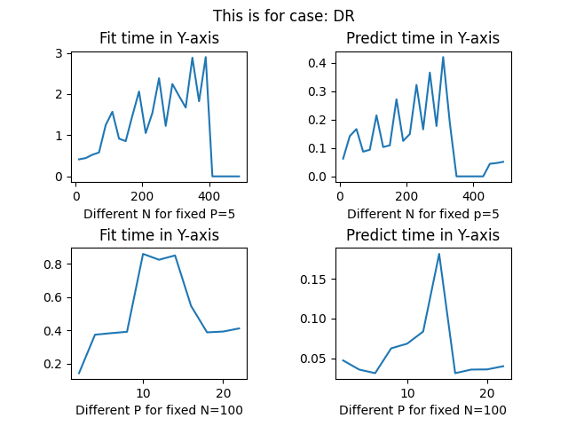

# Visualizing Time complexity by varying P and N 

1.  **Discrete Input and Discrete Output case:-**  
    >

2. **Discrete Input and Real Output case:-** 
    >

3. **Real Input and Discrete Output case:-**
    >

4. **Real Input and Real Output case:-**
    >

* Here we can see that the Real inputs takes a lot of time to compute, Since we have to check all the splits.
* Here the the graph of N vs T is of order O(N2) for Real input and its O(N) for discrete input().
* Same applies for P vs T.
* When it comes to Predict its completely unpridictable and depends on Tree depth and How many times a feature is checked.
* Again Real output cases have Large Trees, which make them consume a little bit extra time.
