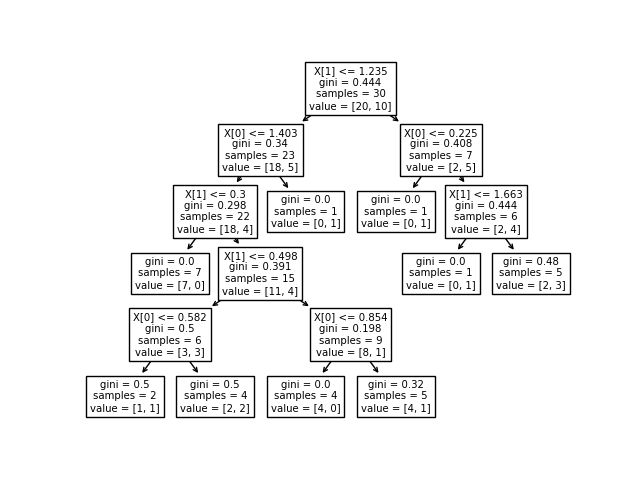
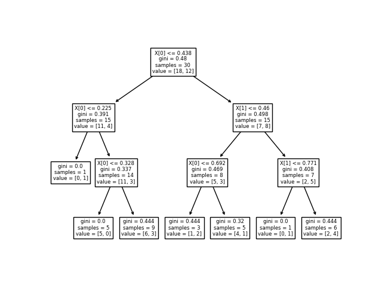
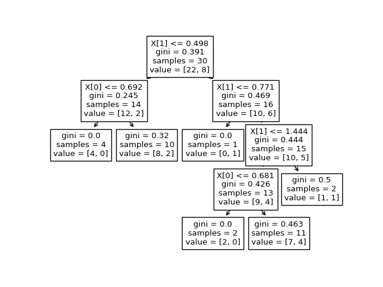
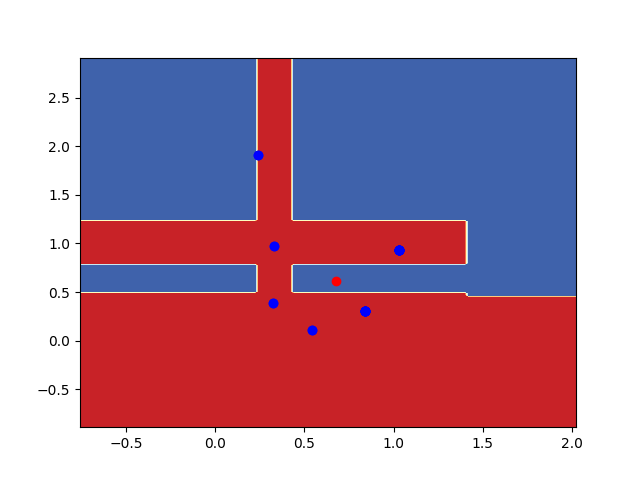

# This is Bagging

* The accuracy for random set is 0.7
* The accuracy depends on number of trees and how its trained. Since I used small and random dataset, its trained randomly so accuracy is very low.

1. **The different trees trained by this model are:** 
    > 
    > 
    > 

2. **The Decision suraface for Bagging(Our Random dataset) is:** 
    > 