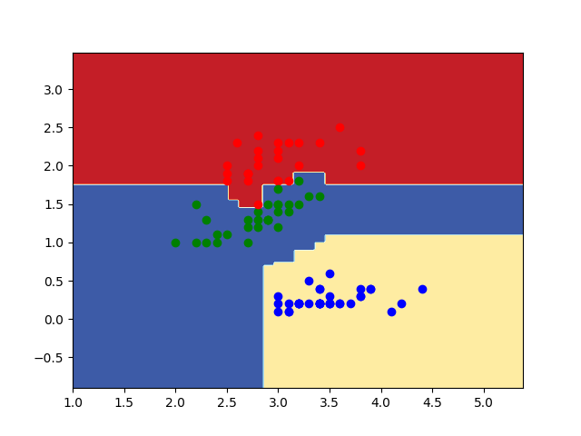

# Random Forest implementation

1. **Accuracy of random Forest on iris data**
    >0.87

2. **Decision surface:**    
    >
# Random forest result on Random input: 

1. **Classifier:**

    >Accuracy is: 0.97

    >Precesion is:

        >"0" : 1
        >"1" : 1
        >"2" : 0.87
        >"3" : 1

    >Recal is:

        >"0" : 0.89
        >"1" : 1
        >"2" : 0.86
        >"3" : 1
2. **Regressor**

    >RMSE : 0.67
    
    >MAE  : 0.5     
